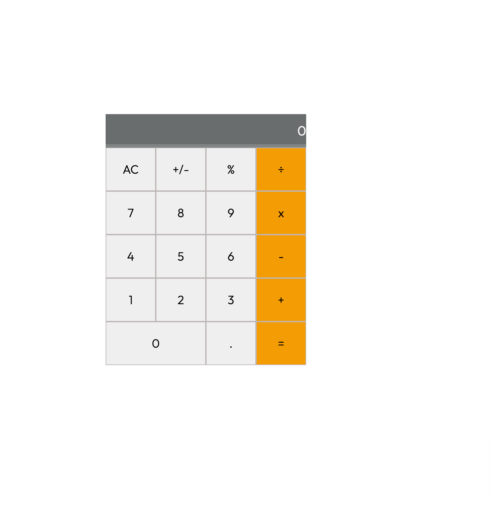

# Maths-magicians
"Math magicians" is a website for all fans of mathematics. It is a Single Page App (SPA) that allows users to:  Make simple calculations. Read a random math-related quote.



## Built With

- HTML, CSS, JavaScript, & React;
- Visual Studio, Git, & GitHub;

## Getting Started

To run this project, you only need a computer with a browser (like Google Chrome, Mozilla Firefox, Microsoft Edge, Apple Safari, etc.) installed, and follow these steps:

1. In your terminal, in the folder of your preference, type the following bash command to clone this repository:

```sh
git@github.com:fortuneonyeka/Maths-magicians.gitLeaderBoard-project.git
```

2. Now that you have already cloned the repo run the following commands to get the project up and running:
```sh
cd LeaderBoard-project
npm install
npm start
```

3. Next, you can start editing this template from the files provided in the `/src` folder. All the changes will be automatically updated on your local server on http://localhost:8080/. You can stop your local server at any time hitting `<Ctrl> + C` on your keyboard.

## Author

👤 **Ihedoro Fortunatus O**

- GitHub: [@fortuneonyeka](https://github.com/fortuneonyeka)
- Twitter: [@onyekafortune](https://twitter.com/onyekafortune)
- LinkedIn: [Ihedoro Fortunatus](https://www.linkedin.com/in/fortunatus-ihedoro/)

## 🤝 Contributing

Contributions, issues, and feature requests are welcome!

## Show your support

Give a ⭐️ if you like this project!

## 📝 License

This project is [MIT](./LICENSE) licensed.
